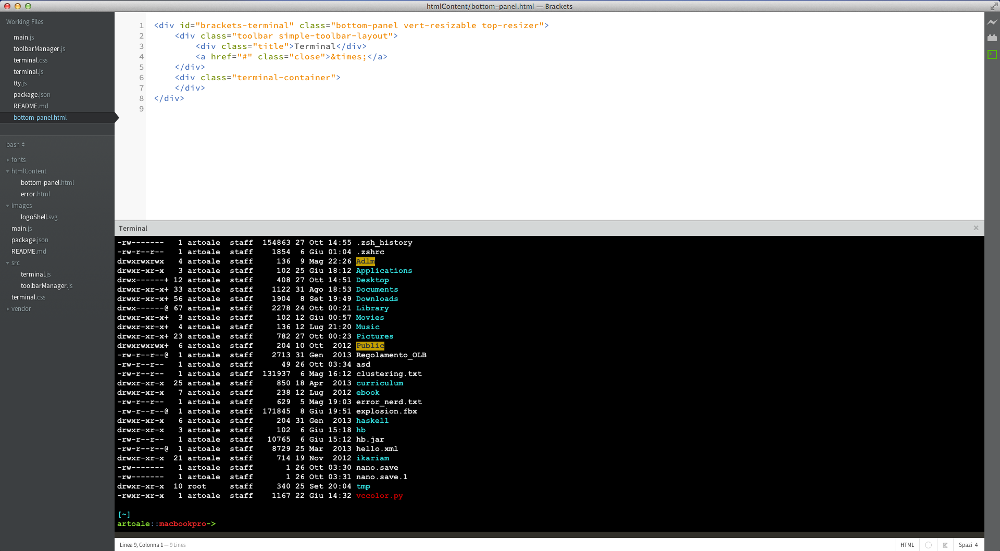
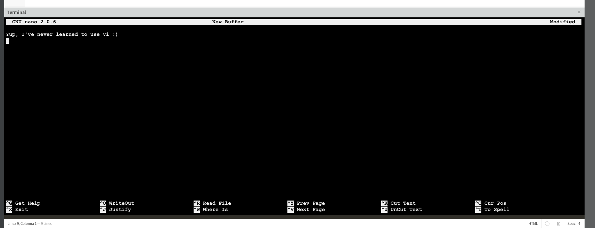

Brackets Terminal
=================

Ever wanted a real console inside your editor? This plugin is what you need!

You can also run another editor inside brackets!

##Installation

* Brackets-terminal requires a [`tty.js`](https://github.com/chjj/tty.js/) server under the hood: run `$ npm install -g tty.js`
* Open a terminal and start the server with `$ tty.js`
* **Bonus**: you may want to add tty.js as a startup process in order to always have it running (see their website for more on configuration)
* Open Brackets > Extension Manager > Available and look for 'Brackets Terminal'. Hit `Install`
* Note that `tty.js` runs on port `8080` by default. You can specify a different port by running it with `tty.js --port <another_number>` and then set the same port in View > Bracket terminal settings

##Usage

You will see a new button on the sidebar as well as a new command in the menu (`View > Show Terminal`) - and a `Cmd/Ctrl+shift+P` keyboard shortcut. If everything goes well,
the button in the sidebar will turn green and a terminal will show up as a bottom panel.
Starting from version 0.3, brackets terminal support multiple tab, too!

##Requirement

* \*nix environment (may work with Cygwin or similar, but not tested)
* `node.js` and `npm` installed

##Troubleshooting

If, for some reason, your button turn yellow try to hit it back, it should go back to gray and another hit should open the terminal again.
If, at startup, the button is light-gray or it becomes red - it's because the tty.js server is no longer running.

##Contribution

Please, report any issue on the github repository, pull requests are welcome too.

